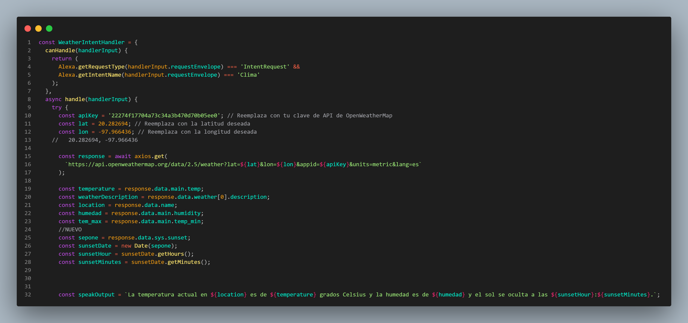
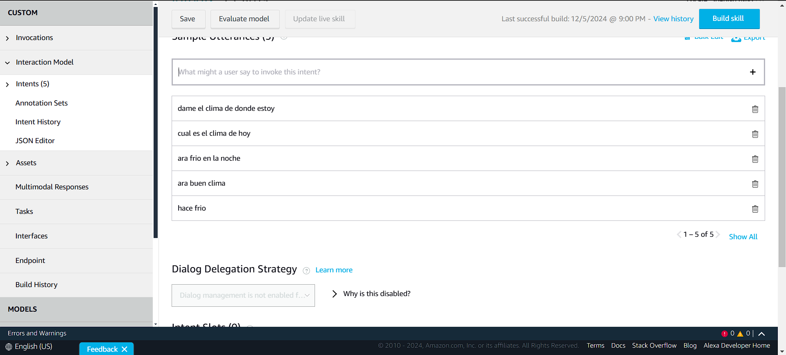
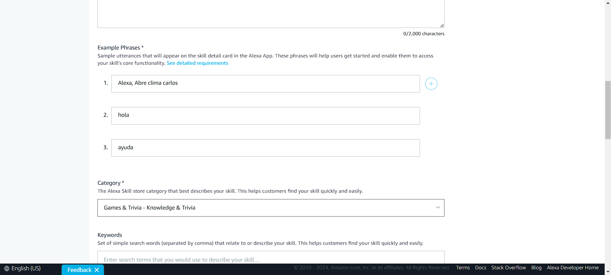
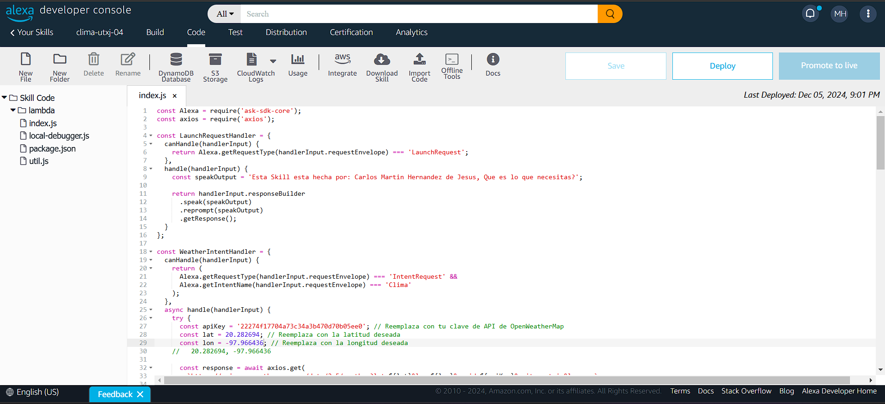
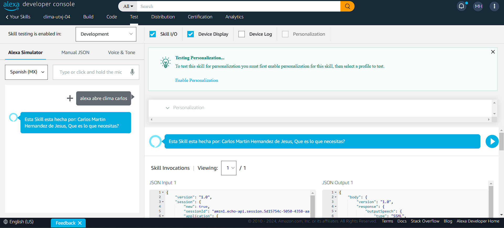
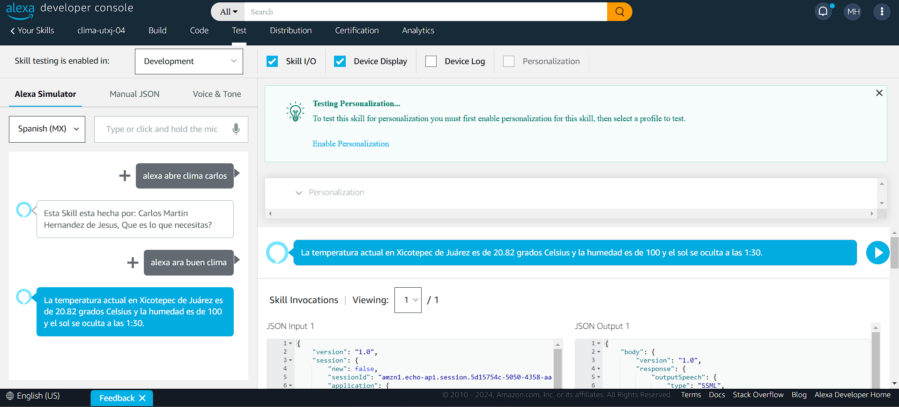

# Universidad Tecnológica de Xicotepec de Juárez

# Datos del Estudiante
|Nombre y Apellidos |Grado y Grupo |Carrera |Matricula
|-------------------------|----------------------|-----------------------------|----------------------|
|Carlos Martin Hernández de Jesús |10 ª A |Ingeniería en Desarrollo y Gestión de Software  |210496 |

## Practica: Amazon - Alexa Skill

### Objetivo
El estudiante deberá configurar Alexa Skill para que pueda recibir datos sobre el clima de donde se encuentra.

### Descripcion
En las clases pasadas se realizó una práctica con el objetivo de configurar una Alexa, para poder hablar con ella y a la vez que nos proporcione datos sobre el clima donde nos encontrabamos, se nos proporcionó un codigo para la configuración sobre este, que se mostrara a continuación.

### Codigo Fuente

### Evidencia

### Resultados
Como podemos observar en los resultados se logro lo comentado en el objetivo, dandonos el llamado y nos proporciono los datos del clima.

